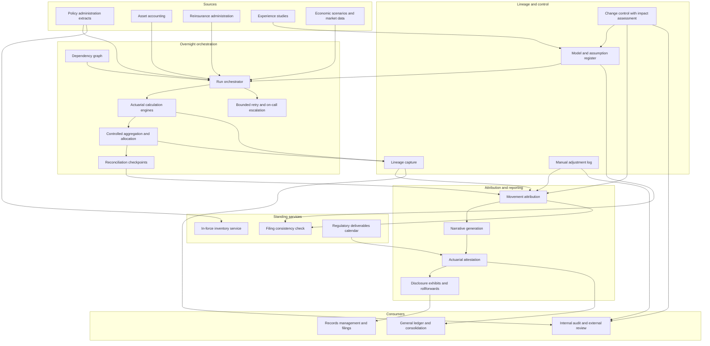

# Nightshift

**Source:** `ai-in-insurance/deloitte-he_Rise_of_the_Exponential_Actuary/`
**Domain:** `ai-ins`
**One-liner:** An actuarial production control plane that runs the valuation and reporting close unattended, attributes every movement in reserves and earnings to a named cause, and drafts the reporting narrative for an actuary to sign — so the actuarial function spends its scarce judgement on the numbers that moved rather than on making the numbers appear.
**Wedge:** The monthly and quarterly valuation close at life and annuity carriers running 50 or more production actuarial models under IFRS 17 or the FASB long-duration targeted improvements, beginning with the reserve and earnings attribution cycle that today ends in hand-assembled spreadsheets and hand-written memos.
**Positioning:** Production infrastructure for the actuarial function, not another modelling platform. Vendors sell the calculation engine; the engine is rarely the bottleneck. Nightshift owns everything around it — the run graph, the reconciliation, the movement attribution, the narrative draft, and the professional sign-off record — so that a chief actuary can shorten the close without weakening the control environment that the actuarial function's independence depends on.

## Market research synthesis

### Thesis from source

The source is Deloitte's Exponential Actuary material presented at the 2018 Asian Actuarial Conference, and its most valuable content is a list of representative actuarial pain points that reads like a system specification. Investment income is calculated, captured, and allocated across 200 or more linked spreadsheets. Monthly actuarial financial reporting requires 10,000 unique tools and spreadsheets. Over 300 actuarial models all need to be maintained, updated, launched manually, and reconciled. A thousand model output files are manually copied and aggregated to refresh actuarial results. Users wake up at 2:00 a.m. to confirm models have completed successfully and to kick off the next job. Ninety people are involved in a six-month process of updating regulatory asset adequacy testing memos. Fifteen hundred hours are spent annually drafting 500 actuarial reports *after* the analysis has been completed. The company produces 150 product filings every year. And a life insurance company does not know how many 90-plus-year-olds it insures. Each item is a control weakness as much as an inefficiency: manual aggregation of a thousand files is an unreconciled restatement risk, and not knowing your own extreme-age exposure is a mortality assumption problem hiding as a data problem.

The document's diagnosis is that the opportunity for actuaries to provide deep business insight is negated by the operational and stewardship activities they perform today, and that the role must be refocused on productivity, business insight, and performance. It places automation on a continuum — robotic process automation mimicking human actions, intelligent automation enabling processes requiring decision making, cognitive automation augmenting human intelligence, and artificial intelligence mimicking human intelligence — and maps the actuarial spectrum of work as ideation and hypothesising, computation and distillation, then application and decision making. The claim is that automation is spreading across all three bands, pushing human work towards higher cognitive engagement rather than eliminating it. Its instruction for finding the opportunity is specific and unusual: pixelate the spectrum of work by breaking the entire end-to-end process into bite-sized chunks, and do not just look at current workload — identify processes that are *not* being performed today because of resource limitations, skill deficiencies, or technology constraints.

The target state is illustrated as a day in the life. At 5:00 a.m. an automated robot completes the running of actuarial models. At 6:00 a.m. the data from the modelling engine is refreshed in the reporting layer. At 7:00 a.m. a natural language generator adds narratives to the dashboard. At 8:00 a.m. the chief actuary has access to updated reports and narratives, at 8:10 interacts with a conversational interface to investigate, and at 8:15 drills into variance analyses by product. The document asserts that all of the technologies required to realise this vision exist today. The persona it builds the case around — a chief actuary — has demands to consolidate data capability, actuarial systems and processes, to respond to concerns around quality including observed errors and lack of consistency, to reduce cost, and to keep pace with regulatory change such as principle-based reserving and the FASB targeted improvements, while desiring to serve the business proactively with insights rather than production.

Two constraints keep this from being a straightforward automation story, and both are stated in the source. First, professionals must continue to meet professional and accountability standards, and how those standards are met will evolve as processes change — an actuarial opinion cannot be delegated to a robot, so automation must produce evidence an actuary can attest to rather than conclusions that bypass attestation. Second, the surrounding talent context is unstable: the source cites a skills half-life of 2.5 to 5 years, average job tenure of 4.5 years, and a shift toward open talent networks and contingent work reaching 40 percent of the US workforce, which means institutional knowledge held in 10,000 spreadsheets walks out of the building on a four-year cycle. The buildable product therefore is not a better model. It is the production layer that turns an unattended run into a signed result: a dependency-aware run graph that replaces the 2:00 a.m. babysitting, automated reconciliation that replaces manual file aggregation, movement attribution that answers why the reserve changed before the chief actuary asks, a narrative draft that removes most of the 1,500 drafting hours, and a control and attestation record that makes the whole chain defensible to auditors and to the actuarial standards the source insists must still be met.

### Buyer & economic model

- **Primary buyer:** Chief Actuary or Appointed Actuary, co-sponsored by the Chief Financial Officer who owns the reporting close calendar and the finance transformation budget.
- **Users:** valuation and reporting actuaries (every cycle), model owners and developers (per model change), the actuarial systems and production team (continuous), pricing and product actuaries relying on the same assumption set (per filing), assumption owners for mortality, lapse, and expense (at each review), financial reporting and controllers (at close), internal audit and actuarial control (periodic), external auditors and reviewing actuaries (annual), and the reinsurance function whose cessions land inside the valuation.
- **Budget owner / value metric:** the actuarial and finance operating budget plus the regulatory change programme. The primary value metric is calendar days to signed close and the share of the cycle spent on analysis rather than production; the secondary is control quality, measured in reconciliation breaks found automatically before sign-off rather than by audit, restatements avoided, and hours removed from the drafting and memo work the source quantifies at 1,500 hours across 500 reports and a six-month, ninety-person memo cycle.
- **Competing status quo:** a modelling engine plus a job scheduler, a shared drive of run outputs, hundreds of linked spreadsheets performing aggregation and allocation, an analysis-of-change workbook rebuilt each quarter, memos and reports drafted in a word processor from last period's version, and a model inventory maintained separately for regulatory purposes. The status quo's defining property is that the control evidence is assembled retrospectively by the same people who did the work, which is exactly what an actuarial function's independence is supposed to prevent.

### Domain constraints

- **Regulatory / trust / safety:** the actuarial function's opinions on technical provisions and on underwriting and reinsurance policy must remain independent and attributable to a named actuary, so automation may prepare but never issue an opinion. Reserving under IFRS 17 requires measurement by group of contracts with contractual service margin movement disclosed, and under the FASB long-duration targeted improvements requires cohort-level remeasurement with disaggregated rollforwards — both make movement attribution a disclosure requirement rather than a management nicety. Principle-based reserving demands model governance and documented assumption support. Asset adequacy testing memoranda carry regulatory filing deadlines. Rate and product filings, which the source counts at 150 per year, require consistency between the pricing basis and the valuation basis. Professional standards require documentation sufficient for another qualified actuary to assess the work, which is the real specification for the audit trail.
- **Data sensitivity:** policy-level valuation extracts carry full demographic and medical underwriting history; experience studies carry mortality and morbidity outcomes. Assumption sets and reserve margins are price-sensitive and market-sensitive before results are announced, so pre-announcement access has to be restricted and logged. Model code and assumption bases are institutionally proprietary, and the source's own data on skills half-life and job tenure makes the retention of *documentation* a business continuity requirement rather than a compliance formality.
- **Change-management realities:** the numbers must tie to the last close on day one, so the platform has to run in parallel with the spreadsheet estate before replacing any of it — and the estate the source describes at 10,000 artefacts cannot be migrated in a single programme. Actuaries will not accept a generated narrative they cannot trace to a movement, and will not sign a result whose lineage they cannot inspect. The 2:00 a.m. run-watching is often a symptom of models with undeclared dependencies, so the dependency graph has to be discovered from actual run behaviour rather than assumed from documentation. Automating the memo and report drafting touches the most visible professional artefacts, so the first release must produce drafts that an actuary edits and signs, never final documents.

## Business requirements

- BR-1: The valuation and reporting close must complete unattended for a defined production window, with failures detected, retried where safe, and escalated to a named on-call owner, so that no actuary is required to wake overnight to confirm a run or start the next job.
- BR-2: Every reported actuarial result must be traceable to the specific model versions, assumption set versions, data extracts, and reinsurance treaty terms that produced it, and that lineage must be reproducible after the fact without re-running the models.
- BR-3: Aggregation and allocation of model outputs into reported results must be performed by controlled, reconciled process rather than manual copying, and any reconciliation break must block sign-off rather than be resolved after publication.
- BR-4: Movement in technical provisions and in reported earnings must be attributed to named causes — new business, expected release, assumption change, experience variance, model change, data correction, reinsurance, and economic movement — to the level of disaggregation the reporting standard requires.
- BR-5: The reporting narrative must be drafted automatically from the attributed movements and presented for actuarial editing and sign-off, and no narrative may be published without a named actuary's attestation.
- BR-6: Documentation for every production model and assumption must be sufficient for another qualified actuary to assess the work, and must be maintained as a condition of the model remaining in production rather than as a periodic remediation exercise.
- BR-7: Model and assumption changes must pass a controlled change process with impact quantified before the change enters a reported close, so that a model change never appears in results as an unexplained experience variance.
- BR-8: The pricing basis used in product and rate filings must be reconcilable to the valuation basis for the same cohort, so that inconsistency between the two is detected before filing rather than at examination.
- BR-9: Exposure and inventory questions about the in-force book — including extreme-age, guarantee, and rider concentrations — must be answerable from the production data without a bespoke project, since the source shows a carrier unable to state how many 90-plus-year-olds it insures.
- BR-10: Access to pre-announcement results, assumption changes, and reserve margins must be restricted and logged by role, and the log must be reportable to internal audit.
- BR-11: The actuarial function's independent opinions must remain attributable to a named actuary, and no automated output may be issued as an actuarial opinion or filed as one.
- BR-12: The platform must report the composition of the close cycle — production time versus analysis time, and hours spent on report and memo drafting — so that the shift the programme is funded to achieve is measured rather than asserted.
- BR-13: Regulatory deliverables with statutory deadlines, including asset adequacy testing memoranda and reporting disclosures, must be tracked against those deadlines with early warning, given the source's account of a six-month, ninety-person memo cycle.

## User stories

Canonical user stories live in sibling [USER_STORIES.md](USER_STORIES.md).

## System design

### Overview

Nightshift wraps the actuarial calculation estate rather than replacing it. A close is instantiated as a *production run* over a dependency-aware graph of jobs: data extraction from policy administration and asset systems, model executions in the existing engines, aggregation and allocation steps that today live in spreadsheets, and reconciliation checkpoints. The orchestrator executes the graph unattended, retries what is safe to retry, and escalates what is not to a named on-call owner. Every job emits its inputs by version — model, assumption set, extract, treaty terms — so the run carries its own lineage. When results land, the attribution engine decomposes movement in technical provisions and earnings into named causes at the disaggregation the reporting standard demands, using the change log to separate model and assumption changes from genuine experience variance. Attributed movements feed a narrative generator that drafts the period's commentary and memo sections, which are then routed for actuarial editing and attestation; nothing publishes without a named signature. Around this sit the control surfaces: a model and assumption register whose documentation requirement is enforced as a production gate, a change control workflow that quantifies impact before a change enters a close, a filing-consistency check between the pricing and valuation bases, an in-force inventory service for exposure questions, and a deliverables calendar tracking statutory deadlines.

### Actors & boundaries

- **Actors:** valuation actuary, chief actuary, model owner, actuarial systems engineer, assumption owner, pricing and product actuary, financial reporting controller, actuarial control reviewer, internal auditor, external reviewing actuary, reinsurance manager.
- **Trust boundary:** the calculation engines, policy administration, asset accounting, and general ledger remain systems of record; Nightshift owns the run graph, lineage, reconciliation, attribution, narrative draft, and attestation. The platform can start, stop, and retry jobs but never edits a model or an assumption — changes enter only through the change control workflow. Attestation is the hard boundary: automated components may prepare and quantify, and only a credentialed actuary may attest, so an actuarial opinion never leaves the system unsigned. Pre-announcement results sit inside a restricted zone with logged access separate from the general reporting audience.
- **Human-in-the-loop points:** approval of a model or assumption change with its quantified impact; adjudication of a reconciliation break; acceptance or rejection of an attributed cause where the attribution is ambiguous; editing and attestation of every narrative, report, and memo; sign-off of the close; approval of a manual adjustment, which must carry a reason and an owner; release of results out of the restricted zone.

### Core capabilities

1. **Run orchestration** — dependency-aware graph execution of extracts, model runs, aggregations, and checkpoints, unattended with bounded retry and named escalation.
2. **Dependency discovery** — derives the graph from observed run behaviour and flags undeclared dependencies that cause overnight failures.
3. **Lineage capture** — binds every result to model version, assumption set version, data extract, and treaty terms, reproducible without re-running.
4. **Controlled aggregation and allocation** — replaces manual file copying and spreadsheet allocation with reconciled, repeatable steps.
5. **Reconciliation and break management** — tie-outs between models, ledger, and prior close, with breaks blocking sign-off.
6. **Movement attribution** — decomposition of reserve and earnings movement into new business, expected release, assumption change, experience variance, model change, data correction, reinsurance, and economic movement.
7. **Narrative generation and attestation** — drafts commentary, disclosure text, and memo sections from attributed movements, routed for actuarial editing and signature.
8. **Model and assumption register** — inventory, ownership, documentation sufficiency, and production status gating.
9. **Change control** — quantified impact assessment and approval before a change enters a reported close.
10. **Filing consistency check** — reconciliation of pricing basis to valuation basis for the same cohort ahead of product and rate filings.
11. **In-force inventory service** — direct answers to exposure and concentration questions including extreme-age, guarantee, and rider exposure.
12. **Deliverables calendar** — statutory and internal deadlines with early warning and capacity view.

### Conceptual data

- **Primary entities:** ProductionRun, RunJob, DependencyEdge, DataExtract, ModelVersion, AssumptionSet, TreatyTerms, ResultSet, ReconciliationCheck, ReconciliationBreak, MovementAttribution, AttributionCause, NarrativeDraft, Attestation, ManualAdjustment, ModelRegistryEntry, DocumentationRecord, ChangeRequest, ImpactAssessment, FilingConsistencyCheck, InforceInventoryQuery, RegulatoryDeliverable, AccessEvent.
- **Critical events:** run scheduled, job started and completed or failed, retry attempted, escalation raised, extract received, result set produced, reconciliation passed or broken, break adjudicated, movement attributed, manual adjustment approved, narrative drafted, narrative edited, attestation signed, close signed off, change requested and approved, documentation lapsed, filing inconsistency detected, deliverable deadline warning, restricted result released.
- **Retention / audit needs:** run lineage, result sets, reconciliations, attributions, attestations, and change records must be retained for the statutory reporting and examination window and long enough to support restatement analysis and the development of long-duration liabilities, which for life and annuity business is measured in decades rather than years. Documentation must remain retrievable and interpretable independent of its author, which is the direct answer to the source's skills half-life problem. Access events on pre-announcement material retain to the market-abuse and audit period. Manual adjustments are permanent records with reason and approver, because an unexplained adjustment is the single most damaging finding in an actuarial control review.

### Integrations (conceptual)

- **Systems of record:** policy administration and in-force extracts, asset accounting and investment systems, actuarial calculation engines, general ledger and consolidation, reinsurance administration, experience study repositories, document and records management for filed memoranda.
- **Upstream signals:** economic scenario generators and market data, mortality and morbidity experience studies, lapse and persistency studies, expense studies and allocation bases, reinsurance treaty amendments, regulatory calendars and standard-setter updates, product and rate filing schedules.
- **Downstream actions:** posting of valuation results to the ledger and consolidation, publication of disclosure exhibits and rollforwards, issuance of signed narratives and memoranda into records management, filing packs for regulators, exposure answers into pricing and reinsurance decisions, on-call escalations, and control evidence packages for internal audit and external review.

### High-level architecture

The orchestration layer runs overnight and is allowed to fail; the attestation layer runs in daylight and is not allowed to be bypassed. Attribution sits between them because it is what converts a completed run into something an actuary can sign in minutes rather than reconstruct over days.

### Success metrics

- **Leading:** share of close jobs completing unattended without human intervention; overnight escalations per cycle and their mean time to resolution; undeclared dependencies discovered and removed; reconciliation breaks detected automatically before sign-off versus found later; proportion of movements attributed automatically without actuarial reclassification; production models with current, sufficiency-tested documentation; manual adjustments per close and their aggregate magnitude.
- **Lagging:** calendar days from period end to signed close; share of cycle hours spent on analysis rather than production; hours spent drafting reports and memoranda against the source's 1,500-hour and six-month baselines; restatements and post-publication corrections; audit and external review findings on actuarial process controls; filing inconsistencies caught before submission; time to answer an in-force exposure question, against the source's example of a carrier unable to state its extreme-age count; assumption-change and model-change impact explained in disclosure versus reported as unexplained variance.

## OpenAPI skeleton

Canonical HTTP surface lives in sibling [openapi.yaml](openapi.yaml). Summary:

- **Base path:** `/v1/...`
- **Auth:** `X-API-Key` for calculation engines, extract jobs, and ledger integrations; Bearer JWT for actuaries, model owners, and reviewers, with attestation restricted to credentialed actuarial roles.
- **Resource groups:** Runs, Lineage, Reconciliation, Attribution, Reporting, Registry, Deliverables.
