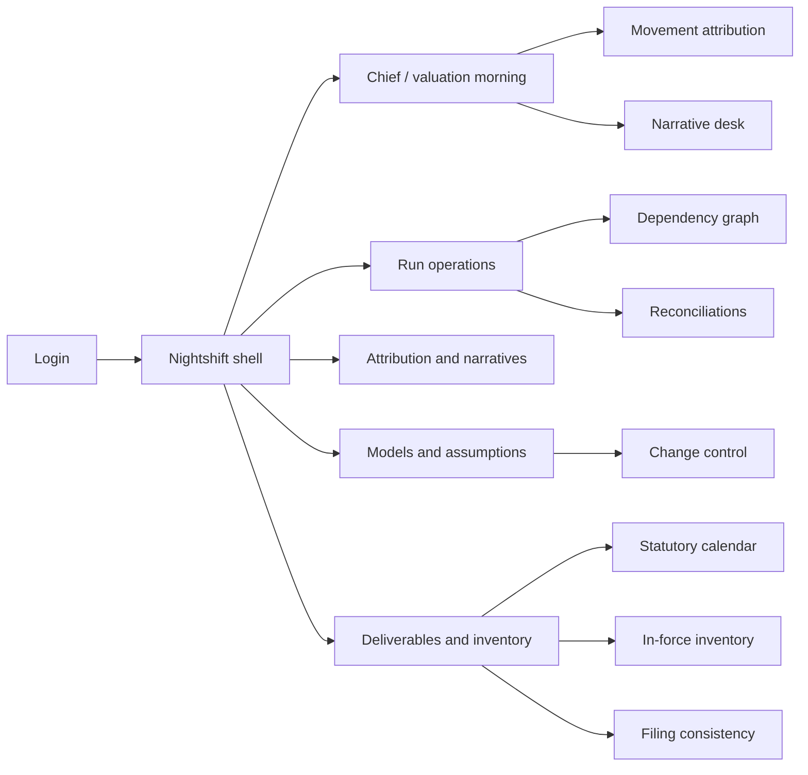
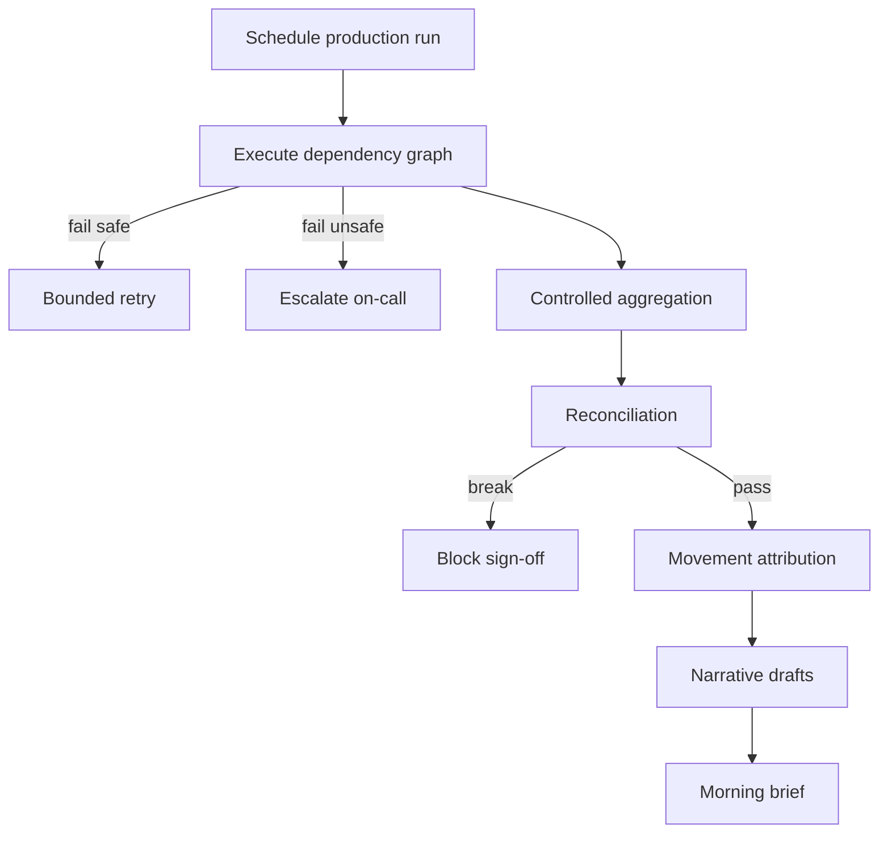

# Nightshift — Web app

**Product:** [PRODUCT.md](./PRODUCT.md)
**Primary surface:** Actuarial close control plane (valuation actuaries + Chief Actuary morning brief)
**Secondary surfaces:** On-call run operations (systems team); attestation/export packs for audit; restricted pre-announcement zone
**Design thesis:** Nightshift is a night-watch control room for the valuation close — not a modelling IDE and not a generic “insights” dashboard. The metaphor is a dependency-lit run graph that finishes before dawn, then a daylight attestation desk where every reserve and earnings movement already carries a named cause. Visual language is deep midnight navy with phosphor-amber job states and chalk-white result panels: overnight failures glow; signed attestations cool to ledger-green. The brand mark sits like a duty stamp on every sign-off surface so an unsigned opinion can never look publishable.

## UX research synthesis

### Category peers (best-in-class)

- **Apache Airflow / Prefect UI:** Dependency DAGs, retry semantics, named owners on failed tasks. Steal: graph-first overnight ops with bounded retry and escalation; reject treating the DAG as the actuary’s primary morning surface.
- **FloQast:** Reconciliation checklists that block close when breaks remain. Steal: break-blocks-sign-off as non-negotiable chrome; reject pure accounting checklist aesthetics that ignore actuarial movement attribution.
- **Workiva (Wdesk):** Controlled narrative drafting, review, and attestation with lineage to source numbers. Steal: draft → edit → named sign workflow; reject publishing generated text as final opinion.
- **OneStream / Oracle Close Management patterns:** Close calendar, task ownership, and restricted pre-release access. Steal: deliverables calendar with statutory early warning; reject ERP task spam as the Chief Actuary home.

### Patterns to adopt / reject

- **Adopt:** Unattended run graph with on-call escalation; lineage drill from any reported figure; reconciliation breaks blocking sign-off; named-cause movement attribution at IFRS 17 / LDTI disaggregation; NLG draft narratives requiring actuarial attestation; documentation as production gate; change impact before close entry; pricing↔valuation filing consistency; in-force inventory queries (including extreme-age).
- **Reject:** 2 a.m. babysitting as a feature; spreadsheet download as the “integration”; unsigned AI opinions; unexplained “other” variance buckets as default; purple AI storytelling panels; editable ledger totals after sign-off.

### Trust, density, and workflow constraints from PRODUCT.md

Actuarial opinions remain human-attributable (BR-11); automation prepares, never files. Lineage must be reproducible without re-run (BR-2). Pre-announcement results are market-sensitive (BR-10). Parallel-run with the spreadsheet estate is required until ties are proven. Density is examination-grade on lineage, reconciliation, and attestation; morning home is sparse — attributed movements first, production noise second (BR-4, BR-5, BR-12).

## Information architecture

### Nav model

### Roles → default home

| Role | Default home | Why |
|------|--------------|-----|
| Valuation actuary | Morning brief — attributed movements | Judge numbers, don’t assemble them (BR-4) |
| Chief Actuary | Morning brief + deliverables calendar | Same-morning executive brief (BR-12, BR-13) |
| Actuarial systems / on-call | Run operations | Unattended close with named escalation (BR-1) |
| Model / assumption owner | Registry + change control | Impact before close (BR-6, BR-7) |
| Pricing actuary | Filing consistency + in-force inventory | Basis tie-out and exposure answers (BR-8, BR-9) |
| Actuarial control / audit | Sign-off pack + access log | Independence evidence (BR-10, BR-11) |

### Cross-links to OpenAPI resources

| Nav area | OpenAPI tags / resources |
|----------|---------------------------|
| Production runs, jobs, retry, dependency graph | Runs |
| Result lineage | Lineage |
| Reconciliations, breaks, manual adjustments | Reconciliation |
| Movement attribution, reclassification | Attribution |
| Narratives, attestation, close sign-off | Reporting |
| Models, assumption sets, change requests | Registry |
| Deliverables, filing consistency, in-force, cycle composition | Deliverables |

## Screen inventory

### Morning brief

- **Purpose:** At 8:00, results and attributed movements are ready — start with judgement, not job restarts.
- **Entry:** Valuation / Chief Actuary login when overnight run complete.
- **Layout regions:** Brand + close period; run status seal (complete / blocked); top attributed movements by product; narrative draft readiness; open reconciliation breaks; cycle composition (production vs analysis).
- **Primary actions:** Drill movement; open narrative desk; open blocking breaks; ask “why did X move?”
- **Empty / loading / error:** Run still in progress = phosphor progress, not empty void; blocked = coral seal with break count.
- **BR / story ties:** BR-1, BR-4, BR-12; Chief Actuary stories.

### Run operations console

- **Purpose:** Unattended graph execution with bounded retry and named on-call escalation.
- **Entry:** Systems team default; alert deep link at 2 a.m. equivalent.
- **Layout regions:** Live DAG; job table (status, owner, retry count); escalation queue; undeclared-dependency flags.
- **Primary actions:** Safe retry; escalate; acknowledge; open lineage of failed job inputs.
- **Empty / loading / error:** Healthy night = quiet green seal; failure = amber/coral with owner.
- **BR / story ties:** BR-1; model owner / systems stories.

### Dependency graph

- **Purpose:** Observed dependencies replace assumed documentation; undeclared edges that cause overnight fails are visible.
- **Entry:** Ops nav; from failed job.
- **Layout regions:** Graph canvas; observed vs declared edges; critical path highlight.
- **Primary actions:** Promote observed edge to declared; open job detail.
- **Empty / loading / error:** Discovery in progress banner during parallel-run phase.
- **BR / story ties:** BR-1; dependency discovery capability.

### Result lineage

- **Purpose:** Any reported figure → model version, assumption set, extract, treaty terms — without re-running.
- **Entry:** Drill from morning brief or disclosures.
- **Layout regions:** Result header; version stack; extract ids; reproducibility package export.
- **Primary actions:** Export lineage pack; compare to prior close versions.
- **Empty / loading / error:** Missing version pin = coral control defect.
- **BR / story ties:** BR-2; valuation actuary defence stories.

### Reconciliation workbench

- **Purpose:** Controlled aggregation tie-outs; breaks block sign-off.
- **Entry:** Morning brief alert; ops; control reviewer.
- **Layout regions:** Check list vs prior close / ledger / models; break detail; adjudication; manual adjustment (reason + owner required).
- **Primary actions:** Adjudicate break; approve adjustment; clear check.
- **Empty / loading / error:** Open breaks = sign-off disabled globally for the run.
- **BR / story ties:** BR-3; valuation stories on blocking breaks.

### Movement attribution

- **Purpose:** Decompose reserve and earnings movement into named causes at required disaggregation.
- **Entry:** Morning brief primary drill.
- **Layout regions:** Rollforward / CSM or LDTI views; cause stack (NB, expected release, assumption, experience, model, data, reinsurance, economic); ambiguous items for reclassification.
- **Primary actions:** Accept attribution; reclassify with reason; open variance analysis by product.
- **Empty / loading / error:** Unattributed residual over threshold = block narrative publish.
- **BR / story ties:** BR-4; Chief Actuary “why did it move?” story.

### Narrative desk

- **Purpose:** NLG draft from attributed movements → actuarial edit → named attestation; never auto-publish.
- **Entry:** Morning brief; reporting nav.
- **Layout regions:** Draft sections linked to attribution anchors; edit surface; attestation panel (credentialed actuary only); publish disabled until signed.
- **Primary actions:** Edit; attest; reject draft; export to records management.
- **Empty / loading / error:** Attempt to publish without attestation = hard refuse (BR-11).
- **BR / story ties:** BR-5, BR-11.

### Close sign-off

- **Purpose:** Package reconciliations, attributions, narratives, adjustments into a signed close.
- **Entry:** After narratives attested and breaks cleared.
- **Layout regions:** Checklist of control gates; attestation roster; restricted-zone release control.
- **Primary actions:** Sign close; release from pre-announcement zone; generate audit pack.
- **Empty / loading / error:** Any open gate = cannot sign.
- **BR / story ties:** BR-3, BR-10, BR-11.

### Model and assumption register

- **Purpose:** Inventory with documentation sufficiency as production gate.
- **Entry:** Model owner home.
- **Layout regions:** Model/assumption tables; owner; doc sufficiency badge; production status; lapsed doc warnings.
- **Primary actions:** Update documentation; request production status; open change request.
- **Empty / loading / error:** Lapsed documentation = cannot enter reported close.
- **BR / story ties:** BR-6.

### Change control with impact

- **Purpose:** Quantify impact before a model/assumption change enters a reported close.
- **Entry:** Registry; change queue.
- **Layout regions:** Change request; impact assessment; approval; scheduled close entry.
- **Primary actions:** Submit impact; approve/reject; bind to attribution (so not mis-labelled experience).
- **Empty / loading / error:** Change without impact = blocked from close graph.
- **BR / story ties:** BR-7.

### Filing consistency

- **Purpose:** Reconcile pricing basis to valuation basis for the same cohort before filing.
- **Entry:** Pricing actuary nav; deliverables.
- **Layout regions:** Cohort selector; basis compare; inconsistency list; filing pack gate.
- **Primary actions:** Resolve inconsistency; export examiner pack.
- **Empty / loading / error:** Inconsistency = block filing pack.
- **BR / story ties:** BR-8.

### In-force inventory

- **Purpose:** Answer exposure questions (extreme-age, guarantees, riders) without a bespoke project.
- **Entry:** Pricing / reinsurance / Chief Actuary query.
- **Layout regions:** Query builder; concentration results; export.
- **Primary actions:** Run inventory query; pin to filing or pricing note.
- **Empty / loading / error:** Extract lag banner if overnight extract incomplete.
- **BR / story ties:** BR-9; “90-plus-year-olds” source pain.

### Deliverables calendar

- **Purpose:** Statutory deadlines (AAT memos, disclosures) with early warning and capacity view.
- **Entry:** Chief Actuary secondary; control.
- **Layout regions:** Timeline; owners; early-warning rail; link to narrative/memo drafts.
- **Primary actions:** Open deliverable; reassign; escalate risk.
- **Empty / loading / error:** Overdue = coral; at-risk = amber.
- **BR / story ties:** BR-13.

### Cycle composition

- **Purpose:** Measure production vs analysis time and drafting hours — the funded shift.
- **Entry:** Chief Actuary; transformation sponsor.
- **Layout regions:** Time split charts; drafting hours; trend vs baseline spreadsheet estate.
- **Primary actions:** Export board pack metric.
- **Empty / loading / error:** Insufficient instrumentation = estimate labelled as such.
- **BR / story ties:** BR-12.

## Key flows

1. **Unattended close to morning brief** — schedule run → graph executes → retries/escalations → reconciliations → attribution → narrative drafts ready by morning; failure: break or escalation blocks sign-off path.

2. **Attest narrative** — draft from attribution → edit → named actuary attests → eligible for close sign-off; refuse unsigned publish.

3. **Model change into close** — change request → impact assessment → approval → scheduled into graph → attribution labels as model change not experience.

4. **Filing consistency** — select cohort → compare pricing vs valuation basis → resolve → release filing pack.

5. **Extreme-age inventory** — query in-force → return concentration → use in pricing/reinsurance without project ticket.

## Design system

### Tokens (CSS variables)

- `--color-ink: #E8EEF5` — text on midnight ground
- `--color-midnight: #070B12` — app ground
- `--color-navy-900: #0E1624` — panels
- `--color-navy-700: #243044` — rules
- `--color-phosphor: #E6B422` — overnight job active / warning
- `--color-phosphor-dim: #8A6A14` — phosphor on dark
- `--color-chalk: #F2F4F7` — daylight result panels
- `--color-chalk-ink: #121820` — text on chalk panels
- `--color-mint: #3CA88A` — attested / signed / reconciled
- `--color-coral: #E05A4C` — break / blocked sign-off / unsigned refuse
- `--color-steel: #7A8FA6` — secondary labels
- `--color-brand: #C9D6E5` — Nightshift wordmark (cool chalk on navy)
- `--font-display: "JetBrains Mono", monospace` — run ids, timestamps, KPI numerals (ops precision)
- `--font-body: "Source Sans 3", sans-serif` — narrative and UI
- `--font-serif: "Source Serif 4", serif` — attested narrative body
- `--space-1`…`--space-8`: 4px scale
- `--radius-sm: 2px`; `--radius-md: 4px` — control-room sharp
- `--motion-job: 160ms linear` — phosphor job state tick
- `--motion-attest: 220ms ease-out` — mint seal on attestation
- `--motion-block: 180ms ease-in` — coral snap when break blocks sign-off
- Atmosphere: midnight navy with faint constellation of dependency nodes; chalk daylight panels for results; no stock “sunrise office” photography.

### Typography & brand

- Mono for run operations and lineage ids; serif for narrative drafts under attestation; sans for chrome.
- Duty-stamp wordmark on sign-off and attestation screens; morning brief titles never outrank the brand seal.
- Login: brand-first (“The close runs while you sleep”); one line; one CTA — no vanity automation %.

### Do / don’t

- **Do:** Graph-first nights; attribution-first mornings; breaks block sign-off; named attestation; documentation gates production; log pre-announcement access.
- **Don’t:** Auto-file opinions; hide residual variance; purple NLG magic; spreadsheet export as primary UX; editable signed results.

### Accessibility & domain trust cues

- AA+ on phosphor/coral/mint vs navy and chalk; blocked states use lock + text.
- Live regions for escalations and break creation.
- Focus order: breaks → attribution → narrative → attest → sign-off.
- Audit packs include machine-readable lineage and attestation hashes.

## Component patterns

- **RunGraphCanvas** — dependency DAG with observed/declared edges.
- **OnCallEscalationChip** — named owner + retry bound.
- **LineageStack** — model / assumption / extract / treaty versions.
- **ReconBreakLock** — blocks close sign-off while open.
- **CauseRollforward** — named attribution causes at standard disaggregation.
- **NarrativeAttestationSeal** — draft/edit/signed states; refuse unsigned publish.
- **DocSufficiencyGate** — production eligibility from documentation.
- **ImpactBeforeClose** — change control gate.
- **FilingBasisCompare** — pricing vs valuation cohort tie-out.
- **InforceQueryBar** — extreme-age and concentration questions.
- **CycleSplitMeter** — production vs analysis time.

## Out of scope for v1 web

- Replacement actuarial calculation engine; full experience-study authoring IDE; general ledger replacement; consumer policyholder portals; native mobile trading-floor apps; automatic filing of actuarial opinions with regulators; wholesale spreadsheet migration wizard in v1 (parallel-run only).
